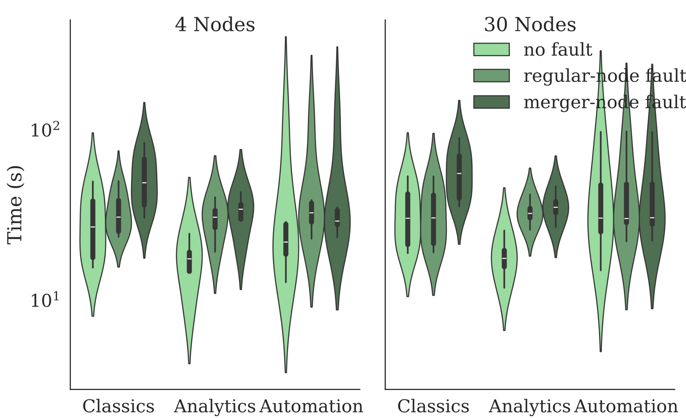

# Overview  
The paper makes the following claims requiring artifact evaluation on page 2 (Comments to AEC reviewers are after `:`):  

1. **Execution engine**: Fractal's light-weight instrumentation, progress and health monitors, and the executor.
2. **Performance optimizations**: Fractal's event-driven executor, buffered-io sentinel striping, and batched scheduling.  
3. **Fault injection**: Fractal's internal subsystem, `frac`, that enables large-scale characterization of fault recovery behaviors.  

This artifact targets the following badges (mirroring [the NSDI26 artifact "evaluation process"](https://www.usenix.org/conference/nsdi26/call-for-artifacts)):  

* [x] [Artifact available](#artifact-available): Reviewers are expected to confirm public availability of core components (~5mins)  
* [x] [Artifact functional](#artifact-functional): Reviewers are expected to verify distributed execution workflow and run a minimal "Hello, world" example (~10mins).
* [x] [Results reproducible](#results-reproducible): Reviewers are expected to reproduce the key result: Fractal’s correct and efficient fault recoveryfor both regular-node and merger-node failures, demonstrated by its performance compared to fault-free conditions (Fig. 7, ~60mins, optionally ~1 week).

Note that Fractal builds on top of DiSh, an MIT-licensed open-source software that is part of the PaSh project.

**To "kick the tires" for this artifact:** (1) Skim this README file to get an idea of the artifact's structure (2 minutes), and (2) Jump straight into the [exercisability](#exercisability) section of the README file (5 minutes).

We will provide the private key and password through HotCRP for reviewers to access the control nodes for both clusters. Save the provided private key to your local machine (e.g., as `fractal.pem`), and change its permission using `chmod 400 fractal.pem`. When connecting via `ssh`, enter the provided password when prompted.

> [!IMPORTANT]
> We have reserved a 4-node cluster and a 30-node cluster on CloudLab **from August 1st to August 24th** for artifact evaluation.
> Reviewers should coordinate with each other to not run experiments at the same time—i.e., use HotCRP comments to notify each other of "locking" the infrastructure until a certain date (ideally, no more than a day).
> _Please start evaluation early_ (in the background), as this kind of resource locking will delay the artifact evaluation process!
 
# Artifact Available (~5mins)
Confirm Fractal is publicly available on GitHub. Below are some relevant links:  

1. Fractal is openly hosted on GitHub ([repo](https://github.com/binpash/fractal/)), including [benchmarks](XXX) and [evaluation scripts](XXX).
2. The Fractal repo is also permanently hosted on [Zenodo](XXX), as an additional level of archival assurannce.
3. All data used in these experiments are publicly available (see URLS in [this README's Appendix](#appendix-input-locations)), as part of the Koala benchmark suite ([Usenix ATC'25 paper](https://www.usenix.org/system/files/atc25-lamprou.pdf), [website](https://kben.sh/, [full inputs](https://github.com/kbensh/koala/blob/main/INSTRUCTIONS.md#inputs)).
4. Fractal's command annotations conform to the ones from [PaSh](https://github.com/binpash/annotations), another MIT-licensed open-source software.  
5. We have a publicly-accessible discord Server ([Invite](http://join.binpa.sh/)) for troubleshooting and feedback.

We note that Fractal is [MIT-licensed open-source software](XXX License XXX), part of the PaSh projecct and hosted by the [Linux Foundation](https://www.linuxfoundation.org/press/press-release/linux-foundation-to-host-the-pash-project-accelerating-shell-scripting-with-automated-parallelization-for-industrial-use-cases).
 
# Artifact Functional (~10mins)  

Confirm sufficient documentation, key components as described in the paper, and the system's exercisability:

**Documentation:** Fractal contains documentation of its top-level structure (e.g., [overall architecture](./README.md), [control-plane](./pash/compiler/dspash/README.md), [runtime](./runtime/README.md)), its key components (e.g., [remote pipes](./runtime/pipe/README.md), [DFS reader](./runtime/dfs/README.md), [runtime helpers](./runtime/scripts/README.md)), its setup and evaluation (e.g., [cluster boostrap](./docker-hadoop/README.md), [evaluation](./evaluation/README.md)), and other elements (e.g., [contribution](./CONTRIBUTING.md), [community](https://github.com/binpash/fractal/tree/main?tab=readme-ov-file#community-and-more). 

**Copmleteness:** The repository's top-level README file offers [a high-level overview](https://github.com/binpash/fractal/?tab=readme-ov-file#repository-structure). In more detail: to support fault-tolerant execution, Fractal:

1. extends the [dataflow compilation with sugraphs and wrappers](pash/compiler/dspash/ir_helper.py) and the [worker manager with subgraph-to-node mapping, dependency tracking, and selective re-execution](pash/compiler/dspash/worker_manager.py) (§4.1–§4.2), and introduces a runtime [datastream wrapper](runtime/pipe/datastream/datastream.go) to decide whether to spill a stream to disk (`--ft dynamic` flag and a `-s` (singular) tag in each `RemotePipe`), reexecuting only non-persisted outputs, and [polls HDFS](pash/compiler/dspash/hdfs_utils.py) via JMX callbacks wired into the scheduler.
2. optimizes execution through an [event-driven worker runtime (§5.1)](pash/compiler/dspash/worker.py) whose lock-free `EventLoop` launches up to *N* subgraphs and `TimeRecorder` logs execution, [buffered-IO sentinel stripping (§5.2)](XXX) where 8-byte EOF tokens are removed on-the-fly using a single 4096-byte buffer, and [batched scheduling (§5.3)](XXX) where the worker manager builds `worker_to_batches` and issues one `Batch-Exec-Graph` RPC per worker;
3. introduces a fault-injection component supported by [helpers](runtime/scripts/killall.sh) that terminate entire process trees (which evaluation scripts driving these hooks to reproduce the fault-tolerance experiments of §6). Together these files (and the PaSh-JIT submodule they build upon) cover every component shown in Fig. 3, demonstrating that the released code fully realises the design presented in the paper.

<a name="exercisability"></a>
**Exercisability:** (1) _Scripts and data_: Scripts to run experiments are provided in the [./evaluation](./evaluation/) directory: [evaluation/run_all.sh](./evaluation/run_all.sh) runs all benchmarks, and the`run.sh` in each benchmark folder (e.g., [the one in classics](evaluation/classics/run.sh) runs individual benchmarks. Input data are downloadable via`inputs.sh`, which fetches datasets from persistent storage hosted on a Brown University (see [Appendix I](#appendix-input-locations)).  (2) _Execution:_ To facilitate evaluation, we pre-allocate and initialize a 4-node and a 30-node cluster with all input data pre-downloaded, available via the `fractal` account (see HotCRP for passwords). To connect to the _control node_ of each cluster:
```bash
# Connect to the 4-node cluster
ssh -i fractal.pem fractal@ms0910.utah.cloudlab.us
# Connect to the 30-node cluster
ssh -i fractal.pem fractal@ms0820.utah.cloudlab.us
```

To connect to the client container:
```bash 
# Run the interactive shell inside the client continaer
sudo docker exec -it docker-hadoop-client-1 bash
```

To run Fractal with a minimal `echo` example under a fault-free setting:
```bash
$FRACTAL_TOP/pash/pa.sh --distributed_exec -c "echo Hello World!" 
```

# Results Reproducible (~60mins)

The key result in this paper’s evaluation is that **Fractal provides correct and efficient recovery** for both regular-node and merger-node failures. This is demonstrated by its performance compared to fault-free conditions (§6.2, Fig. 7).

**Terminology correspondence:** Here is the correspondence of flag names between the paper and the artifact:
* Fractal (no fault): `--width 8 --r_split --distributed_exec --ft dynamic`
* Fractal (regular-node fault): `--width 8 --r_split --distributed_exec --ft dynamic --kill regular`
* Fractal (merger-node fault):`--width 8 --r_split --distributed_exec --ft dynamic --kill merger`

**Execution and Plotting:** We provide two input load sizes for testing and evaluating Fractal:
- `--small`: Uses a reduced input size, resulting in shorter execution time (~XX hours).  
- `--full`: Matches the input size used in the paper (~XX hours).

The `--small` option produces results that closely match those presented in the paper. All key performance differences between configurations are still clearly observable. 

This section also provide detailed instrauctions on how to replicate Fig. 7 of the experimental evaluation of Fractal as described in Table 2: [Classics](./evaluation/classics/), [Unix50](./evaluation/unix50/), [NLP](./evaluation/nlp/), [Analytics](./evaluation/analytics/), and [Automation](./evaluation/automation/).

To run all the benchmarks with `--small` input from the control node **for each cluster**:

```bash
# open the interactive shell for the client container
sudo docker exec -it docker-hadoop-client-1 bash

# enter the eval folder
cd $FRACTAL_TOP/evaluation

# There are two options here, either use --small or --full as an argument to determine the input size.
# To facilitate the review process, we populate the data using `bash inputs_all.sh --small` (~20 minutes)
# Optionally, reviewers can run `bash inputs_all.sh` to clean up and regenerate all data from scratch.
bash run_faulty.sh --small
```

Generating the plots requires data from both clusters. To parse the per-cluster results, run the following command with `--site 4` for the 4-node cluster or `--site 30` for the 30-node cluster:

```bash
# Parse results for a single cluster
./plotting/scripts/parse.sh --site 4
# OR
./plotting/scripts/parse.sh --site 30
```

After parsing results from both clusters, run the following command on any control node to generate the final figures by aggregating the results:

```bash
# Generate the plots
./plotting/scripts/plot.sh ms0910.utah.cloudlab.us ms0820.utah.cloudlab.us
```

Once the script completes, follow its prompt open the following URLs in a browser to view the generated figures, for example:
```
Fig. 7: http://ms0910.utah.cloudlab.us/fig7.pdf
```

Example output generated from the artifact:
<p align="center">
  
</p>

<!-- We have included in this repo sample data of the raw data timers (run.tmp), the final source data (data_final.csv) and the three output figures: [Fig. X](), [Fig. Y](), and [Fig. Z]() -->

<!-- > After benchmarks complete, rebuild plotting datasets and figures:
> ```bash 
# Merge raw_times_site*.csv first if you collected results on both clusters
> evaluation/plotting/scripts/merge_sites.sh \
>     evaluation/results/raw_times_site4.csv evaluation/results/raw_times_site30.csv
>
> # Pre-process into the three figure datasets
> python evaluation/plotting/scripts/preprocess.py
>
> # Generate PDFs (figures/<timestamp>/)
> python evaluation/plotting/scripts/plot.py
> ```
>
> If you ran inside Docker on a remote VM, copy the PDFs out:
> ```bash
> docker cp docker-hadoop-client-1:/opt/dish/evaluation/plotting/figures ./plots
> scp -i <pem> user@<vm-host>:~/plots/*.pdf ./local_plots/
> ``` -->

## [Optional (~1 week)] 

We provide three optional experiments to validate additional results presented in the paper:
* **Fault-free performance**: Fractal achieves near **state-of-the-art** performance in failure-free execution, comparable to DiSh and Hadoop Streaming (§6.1, Fig. 5).
* **Dynamic output persistence**: Fractal strikes a subtle balance between accelerated fault recovery and low overhead during fault-free execution (§6.3, Fig. 8).
* **Hard faults**: Fractal efficiently recovers from hard faults, such as complete worker machine shutdowns.

### Fault-free execution
FRACTAL also delivers near state-of-the-art performance in failure-free executions (§6.1, Fig.5).

### Dynamic output persistence

### Hard faults (manual efforts)
Optionally, you may try to introduce *hard faults*. However, despite its conceptual simplicity, introducing and monitoring *hard faults* requires significant time and effort. 

As shown at the bottom of page 10, replicating the presented hard faults experiment involves `3 completion percents × 3 system configs (AHS, regular ,
merger ) × 2 failure modes × 5 repetitions × 3 benchmarks = 270 experiments`, which took about a week of manual effort.

The procedures are listed below (let's set the experiment config for classics/top-n.sh, fault at 50%, merger fault):

1. Prerequisites: set up a cloud deployment for Fractal
2. Follow the [Exercisability](#exercisability) section of the instruction file to enter the interactive shell for the client node
2. Set up benchmark input: `cd $FRACTAL_TOP/evaluation/classics; ./inputs.sh`
3. To simplify the experiment, comment out all lines from L23-32 except for L25 in run.sh file to run only top-n
3. Run the fault-free execution to record the fault-free time: `./run.sh`
4. Collect the ip address for all other remote nodes' datanode container. One simple way is to do `hostname -i`
5. When the fault-free run is complete, run `./run.sh` again and *start a timer on the side*
6. During scheduling the worker-manager stores the IP of the machine that will run the merger sub-graph in a small helper file. `cat $PASH_TOP/compiler/dspash/hard_kill_ip_path.log` contains two lines:
- Line 1 -> IP (or hostname) of the merger node.
- Line 2 -> IP of one regular (non-merger) nod
7. Now when the timer has reached 0.5*{fault-free time}, shutdown the remote node corresponding to the merger node's ip. If you are using a cloudlab deployment, one way to do so is through cloudlab's web console for the corresponding log. Click the corresponding GUI and select the "terminate" option for non-graceful shutdown
8. When Fractal detects, recovers, and eventually completes this run (in the client's container), reboot the just-shutdown node, and wait until it's back up
9. To make sure it is back and stable, we need to check whether all of its data blocks are back online (i.e., whether replication factor is satisfied)

## Appendix: Input locations

The Fractal project uses some of the Koala benchmarks ([Usenix ATC'25 paper](https://www.usenix.org/system/files/atc25-lamprou.pdf), [website](https://kben.sh/), [full inputs](https://github.com/kbensh/koala/blob/main/INSTRUCTIONS.md#inputs)), thus uses some of the inputs permanantely stored by the Koala authors: 
[1M](https://atlas-group.cs.brown.edu/data/dummy/1M.txt), 
[dictionary](https://atlas-group.cs.brown.edu/data/dummy/dict.txt), 
[books](https://atlas-group.cs.brown.edu/data/gutenberg/books.txt), 
[Bible](https://atlas-group.cs.brown.edu/data/gutenberg/8/0/0/8001/8001.txt), 
[Exodus](https://atlas-group.cs.brown.edu/data/gutenberg/3/3/4/2/33420/33420-0.txt), 
[Gutenberg](https://atlas-group.cs.brown.edu/data/gutenberg/), 
[PCAP](https://atlas-group.cs.brown.edu/data/pcaps.zip), 
[nginx logs](https://atlas-group.cs.brown.edu/data/nginx.zip), 
[wav file](https://atlas-group.cs.brown.edu/data/wav.zip), 
[small jpg files](https://atlas-group.cs.brown.edu/data/small/jpg.zip), 
[full jpg files](https://atlas-group.cs.brown.edu/data/full/jpg.zip), 
[unix50 inputs](http://atlas-group.cs.brown.edu/data/unix50/), 
[COVID small](https://atlas-group.cs.brown.edu/data/covid-mts/in_small.csv.gz), 
[COVID full](https://atlas-group.cs.brown.edu/data/covid-mts/in.csv.gz), 
[NOAA data](http://atlas-group.cs.brown.edu/data/noaa/).

