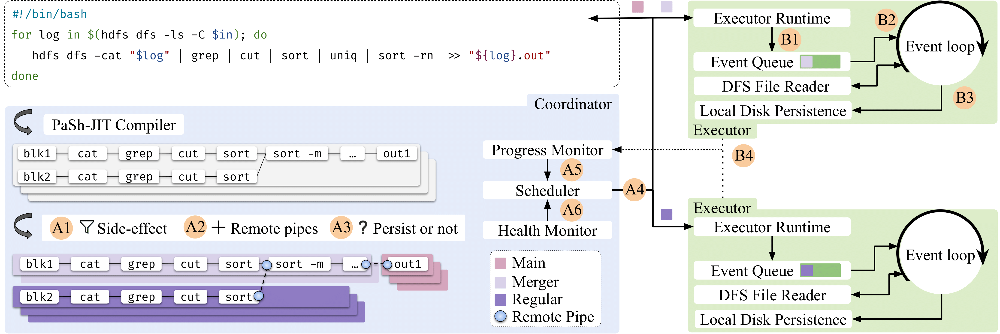

# Fractal: Fault-Tolerant Shell-Script Distribution
[Overview](#overview) | [Quick Setup](#quick-setup) | [More Info](#more-information) | [Structure](#repository-structure) | [Community](#community-and-more) | [Citing](#citing-fractal) | [License & Contributions](#license-and-contributing)

> For issues and ideas, email [fractal@brown.edu](mailto:fractal@brown.edu) or, better, [open a GitHub issue](https://github.com/binpash/fractal/issues/new/choose).
>

Fractal executes unmodified POSIX shell scripts across a cluster and recovers automatically from node failures.
It bolts failre tolerance on top of DiSh, a state-of-the-art shell-script distribution system, and is described in an upcoming [NSDI'26](https://www.usenix.org/conference/nsdi26) [paper](#citing-fractal).

## Overview:

Fractal is an open source, MIT-licensed system that offers fault-tolerant distributed execution of unmodified shell scripts. 
It first identifies recoverable regions from side-effectful ones, and augments them with additional runtime support aimed at fault recovery.
It employs precise dependency and progress tracking at the subgraph level to offer sound and efficient fault recovery.
It minimizes the number of upstream regions that are re-executed during recovery and ensures exactly-once semantics upon recovery for downstream regions. 
Fractal's fault-free performance is comparable to state-of-the-art failure-intolerant distributed shell-script execution engines, while in cases of failures it recoveres 7.8–16.4× compared to Hadoop Streaming.

At a glance:
- [x] No script changes – full POSIX shell semantics.  
- [x] Exactly-once semantics via remote pipes and replay suppression.  
- [x] Per-subgraph dynamic decision to persist or stream data
- [x] Millisecond-scale re-scheduling driven by HDFS heartbeats + 17-byte events.

## Quick Setup
To quickly set up Fractal on a single host (Docker Compose, tested on Linux):

```bash
# Clone with submodule so PaSh code is present
$ git clone --recurse-submodules https://github.com/binpash/dish.git
$ cd dish/docker-hadoop
# Spin up 1 namenode, 1 datanode, 1 client container
$ ./setup-compose.sh
```

To tear Fractal down: `./stop-compose.sh` (add `-v` to prune volumes).

## More Information

After installing fractal, run it inside the client container:

```bash
# put a sample file in HDFS
hdfs dfs -put /etc/hosts /hosts
# Execute a tiny script with fault tolerance on (dynamic persistence)
cd /opt/dish
./fractal.sh --ft dynamic scripts/sample.sh   # output identical to bash
```
Inject a fail-stop fault: `./fractal.sh --ft dynamic --kill regular scripts/sample.sh`.


## Repository Structure

Here are the key components of the Fractal repository:

* [`pash/`](pash/): PaSh submodule – compiler & JIT groundwork
* [`runtime/`](runtime/): Remote Pipe, DFS reader, Go libraries
* [`pash/compiler/dspash/`](pash/compiler/dspash/): Fractal scheduler, executor, along with health and progress monitors
* [`docker-hadoop/`](docker-hadoop/): Local and CloudLab cluster bootstrap
* [`evaluation/`](evaluation/): Benchmarks & fault-injection scripts
* [`scripts/`](scripts/): Miscallencous helper scripts

**Detailed system architecture:** The figure below describes Fractal's key components. `A1`–`A6` annotate control-plane stages; `B1`-`B4` run on each executor. Fractal first isolates side-effectful regions from recoverable regions; it then executes recoverable subgraphs on nodes, tracking locality, dependencies, progress, and health; and it detects failures, re-scheduling the minimal set of unfinished subgraphs for re-execution.



The list of components is explained below, along with their location in the code:
* `A1`: DFG augmentation and isolation of the unsafe-main subgraph (in [`prepare_graph_for_remote_exec`](pash/compiler/dspash/ir_helper.py))
* `A2`: Remote pipe instrumentation, which injects read/write nodes that track byte offsets (in [`remote_pipe`](/pash/compiler/definitions/ir/nodes/remote_pipe.py), [`pipes`](./runtime/pipe/))
* `A3`: Dynamic output persistence, a heuristic that chooses between spilling to disk or streaming (in [`add_singular_flags`](./pash/compiler/dspash/ir_helper.py), [`check_persisted_discovery`](./pash/compiler/dspash/worker_manager.py), [`optimized write`](runtime/pipe/datastream/datastream.go))
* `A4`: Scheduler and batched dispatch of subgraphs to executors ([`worker_manager`](pash/compiler/dspash/worker_manager.py))
* `A5`: Progress monitor and discovery, a 17-byte completion events and endpoint registry ([`discovery`](runtime/pipe/discovery/), [`datastream`](runtime/pipe/datastream/datastream.go))
* `A6`: Health monitor, which polls HDFS Namenode JMX to identify slow/failed nodes ([`hdfs_utils`](pash/compiler/dspash/hdfs_utils.py))
* `B1`: Executor no-blocking event loop, which launches subgraphs ([`EventLoop`](pash/compiler/dspash/worker.py))
* `B2`: Remote pipe data path within executor (socket/file, buffered I/O) ([`datastream`](runtime/pipe/datastream/datastream.go))
* `B3`: Distributed file reader, which streams HDFS splits locally ([`dfs`](runtime/dfs/))
* `B4`: On-node cache of persisted outputs, which avoids re-computation after faults ([`optimized write`](runtime/pipe/datastream/datastream.go))

## Community and More

Fractal is a member of the PaSh family of systems, availabile by the [Linux Foundation](). Please join the community:

* Chat: [Discord](http://join.binpa.sh/) 
* Email: [fractal@brown.edu](mailto:fractal@brown.edu) 
* Issues: [Open a GitHub issue](https://github.com/binpash/fractal/issues/new/choose)

## Citing Fractal

Fractal is backed up by state-of-the-art research—if you are using it to accelerate your processing, consider citing the following paper:

```bibtex
@inproceedings{fractal:nsdi:2026,
 author = {Zhicheng Huang and Ramiz Dundar and Yizheng Xie and Konstantinos Kallas and Nikos Vasilakis},
 title = {Fractal: Fault-Tolerant Shell-Script Distribution},
 booktitle = {23rd USENIX Symposium on Networked Systems Design and Implementation (NSDI 26)},
 year = {2026},
 address = {Renton, WA},
 publisher = {USENIX Association},
 month = may
}
```

<details><summary>(More bibtex) Fractal builds on DiSh and PaSh</summary>

The DiSh paper, from NSDI'23:

```bibtex
@inproceedings{dish:nsdi:2023,
 author = {Tammam Mustafa and Konstantinos Kallas and Pratyush Das and Nikos Vasilakis},
 title = {{DiSh}: Dynamic {Shell-Script} Distribution},
 booktitle = {20th USENIX Symposium on Networked Systems Design and Implementation (NSDI 23)},
 year = {2023},
 isbn = {978-1-939133-33-5},
 address = {Boston, MA},
 pages = {341--356},
 url = {https://www.usenix.org/conference/nsdi23/presentation/mustafa},
 publisher = {USENIX Association},
 month = apr
}
```

The PaSh paper, from OSDI'22:
```bibtex
@inproceedings{pash:osdi:2022,
 author = {Konstantinos Kallas and Tammam Mustafa and Jan Bielak and Dimitris Karnikis and Thurston H.Y. Dang and Michael Greenberg and Nikos Vasilakis},
 title = {Practically Correct, {Just-in-Time} Shell Script Parallelization},
 booktitle = {16th USENIX Symposium on Operating Systems Design and Implementation (OSDI 22)},
 year = {2022},
 isbn = {978-1-939133-28-1},
 address = {Carlsbad, CA},
 pages = {769--785},
 url = {https://www.usenix.org/conference/osdi22/presentation/kallas},
 publisher = {USENIX Association},
 month = jul
}
```

</details>


## License & Contributions

Fractal is an open-source, collaborative, [MIT-licensed](https://github.com/atlas-brown/slowpoke/blob/main/LICENSE) project available by the Linux Foundation and developed by researchers at [Brown University](https://cs.brown.edu/) and [UCLA](https://www.cs.ucla.edu/). If you'd like to contribute, please see the [`CONTRIBUTING.md`](./CONTRIBUTING.md) file—we welcome contributions! And _please come talk to us_ if you're looking to optimize shell programs!
